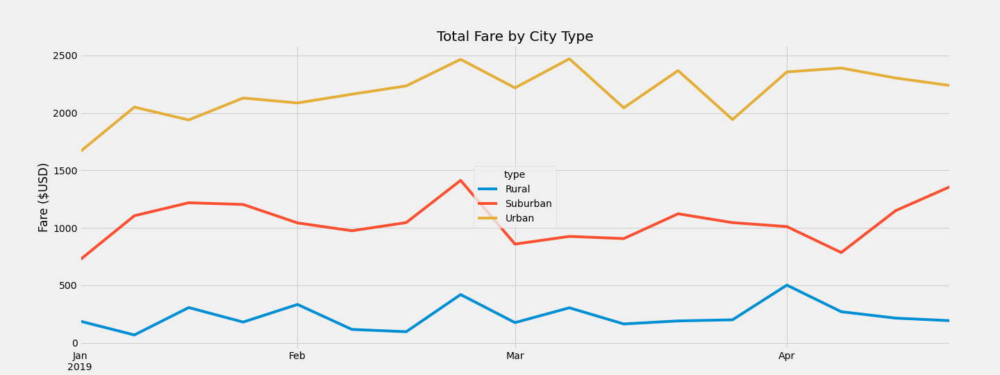

# PyBer_Analysis
## Overview 
Analyze & showcase relationships of large ride share data files to create an overall snapshot of the data with a summary table of key metrics by city type and a multi-line graph that shows the average fare for each week by city type. 

## Results 

### Summary Statistics

- Total Rides: Urban areas have about 3 times as many rides as Suburban areas, which have about 4 times as many rides as Rural areas 
- Total Drivers: Urban areas, with 2,405 drivers, have significantly more drivers than Suburban areas (490 drivers) and Rural areas (78 drivers)
- The average fare per ride and average fare for driver are the most expensive in Rural areas and cheaper in Urban cities
- Correlation between average fare & total rides for city types: There is an inverse relationship between average fares and total rides for city types.

### Summary of plotted fares for city type over time 

## Summary 
The mutli-line graph helps us visualize the ride share data and shows us that all city types have had fairly consistent total fares over time. Of course, there are still a few spiles in the data but overall, the pattern is quite consistent. The graph also shows that the majority of money comes from Urban cities followed by Suburban cities, with Rural cities brining in the least amount of money. The summary Dataframe and the multi-line graph show that the average fare of a Rural ride is higher, however, more money is made from Urban rides in total.